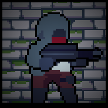

# Project Adder

##  About

Project Adder is a 2D zombie shooting sandbox by [Nathan Bennett](https://nlb.dev). It is available for free on [Steam](https://store.steampowered.com/app/2598410/Project_Adder/). If you have questions feel free to dm on discord: @draspur 

##  Contributing

### Using Construct 3 
Project Adder was originally developed in Construct 2 but has since been ported to [Construct 3](https://www.construct.net/en).

Because of the size of the project, I find the vanilla UI to be incredibly impracticable. I *highly* recommend using a custom theme. I recommend either [PROCSS](https://mitsuhashish.itch.io/procss) or [DARCSS](https://mitsuhashish.itch.io/darcss).

### Git 
For Construct 3, I recommend using [Github Desktop](https://desktop.github.com/) for a clearer display of pending changes.

#### Working with Branches
To make sure the main game remains stable, don't make changes directly to the `main` or `dev` branch. Instead:

1. Create a new branch for each set of changes or features you want to work on.
2. Make sure your branch is up-to-date with the `dev` branch before starting.
3. Once you've finished your changes, push your branch to the repository.

#### Making a Pull Request (PR)
When you're ready to have your changes reviewed and possibly merged into the main game:

1. Create a new pull request with a description of your changes.
2. The maintainers  will review your PR. They might request some changes or merge it directly into `dev`, where it will pend a merge into `main`, at which point it may be republished on platforms.

Remember: Keeping your PRs smaller and focused on one thing makes them easier to review and merge.

##  Licensing

### Summary    
The game's source code is released under the GNU General Public License (GPL) v3.0, which means it can be freely used, modified, and distributed, as long as any modifications to the code are also made available under the same terms.

The art assets in the /art/ and Adder/images/ directories are available under the Creative Commons Attribution-NonCommercial-ShareAlike 4.0 International License (CC BY-NC-SA 4.0). This allows you to share and adapt the art assets as long as you give credit, avoid commercial use, and share any modified versions under the same license.

The music in the /music/ directory **cannot be redistributed or used outside of this repository**. It's solely intended for use within the Project Adder game, and any other use is prohibited.

If you have any questions, are interested in licensing the source code privately, or licensing the art for commercial projects, please contact the project owner.
### Game Source Code
Project Adder's source code is released under the [GNU General Public License (GPL) v3.0](https://www.gnu.org/licenses/gpl-3.0.en.html). See the [LICENSE](LICENSE) file for details.

### Art Source Files

All art assets included in this repository, located in the `/art/` and `Adder/images/` directories, are released under the [Creative Commons Attribution-NonCommercial-ShareAlike 4.0 International License (CC BY-NC-SA 4.0)](https://creativecommons.org/licenses/by-nc-sa/4.0/).

This means you are free to:

- **Share:** Copy and redistribute the material in any medium or format.
- **Adapt:** Remix, transform, and build upon the material.

Under the following terms:

- **Attribution:** You must give appropriate credit, provide a link to the license, and indicate if changes were made. You may do so in any reasonable manner, but not in any way that suggests the licensor endorses you or your use.
- **NonCommercial:** You may not use the material for commercial purposes.
- **ShareAlike:** If you remix, transform, or build upon the material, you must distribute your contributions under the same license as the original.

For the full terms, see the [LICENSE in the art folder](Adder/images/LICENSE).

### Music

**Important**: The music included in the `/music/` directory of this repository is **NOT** covered by the project's GPL license and may **NOT** be redistributed or used outside of this repository. The music tracks are the property of their respective creators and are included here with permission for use only within the context of the Project Adder game. Any other use is strictly prohibited.

For the full terms, see the [LICENSE in the music folder](Adder/armusic/LICENSE). Please support the artists!

##  Attribution

- Art - Nick N ([Twitter](https://twitter.com/Nootall_) / [Youtube](https://www.youtube.com/@nootall))

- Additional Art - [Okkoinu](https://okkoinu.com/)

- Music - [Diwa "String Player Gamer" de Leon](https://www.youtube.com/@StringPlayerGamerOfficial)

- SFX - https://freesound.org (CCO)

---

